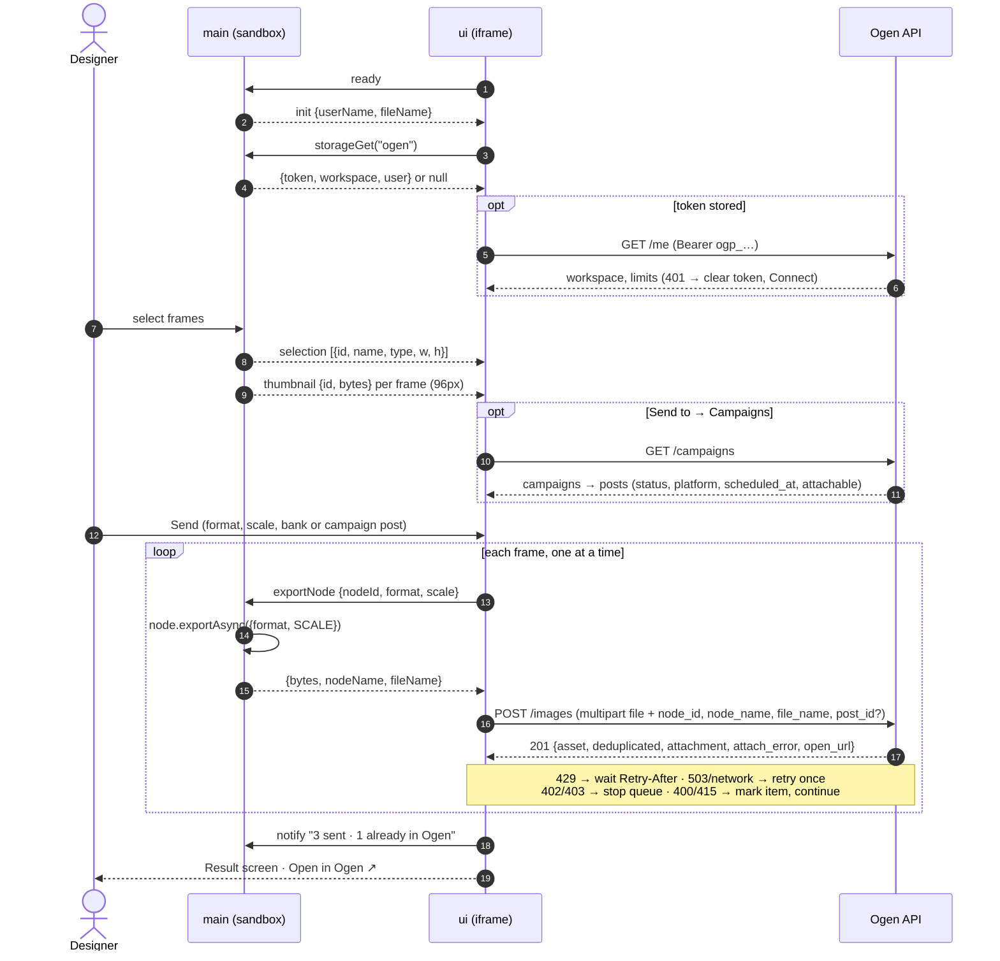
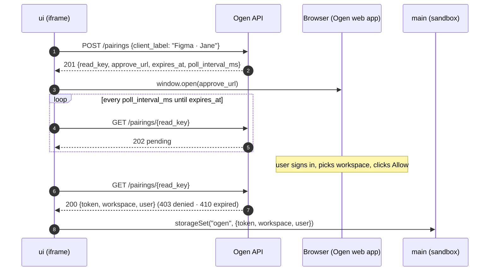
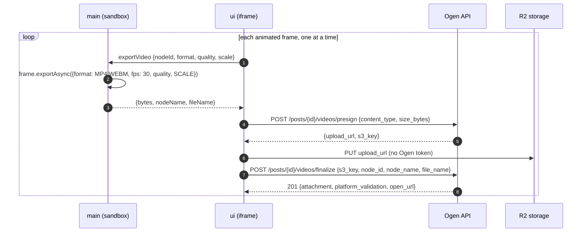

# Ogen Figma plugin

"Send to Ogen": select frames in Figma and send them to an Ogen workspace's
content bank, optionally attaching them to a campaign post in the same step.
"Campaign boards" lays out a campaign's posts as placeholder frames and sends
each one straight to its post.

The plugin renders frames locally with `node.exportAsync()` and uploads the
bytes to Ogen's plugin API (`/api/plugins/figma/*`), authenticated by a plugin
token obtained once through a pairing flow. Ogen never calls Figma's REST API.
Backend and design: [CON-338](https://linear.app/ogen/issue/CON-338); this
plugin: [CON-340](https://linear.app/ogen/issue/CON-340).

## Requirements

- Node 22 (`.nvmrc`)
- Figma desktop app (plugins under development can only be imported there)
- For end-to-end runs: the Ogen API and UI running locally (`ogen-app/ogen`
  and `ogen-app/ui`), with the plugin API from CON-338

## Local development

```sh
npm ci
npm run dev          # dev build in watch mode, API at http://localhost:9001
npm run dev:remote   # same, against the dev environment (https://api.dev.getogen.com)
```

1. Start the Ogen API locally on `:9001` (the port `ogen-app/ui` proxies to),
   or use `npm run dev:remote` to skip the local stack and talk to the dev
   environment.
2. In Figma desktop: **Plugins → Development → Import plugin from manifest…**
   and pick this repo's `manifest.json`.
3. Run it from **Plugins → Development → Ogen**. Rebuilds are picked up the
   next time the plugin runs.
4. Logs and errors: **Plugins → Development → Show/Hide console**. Dev builds
   print an `[ogen] editorType=… file=… user=…` line on start (see
   [docs/spikes.md](docs/spikes.md)).

`npm run dev` only rebuilds `dist/` on changes. It does not start a web
server, so there is no page to open in a browser: the plugin runs inside
Figma.

Pairing opens the approval page at the API's `APP_BASE_URL`, which defaults
to production (`https://app.getogen.com`). To approve against your local
stack, set it in `ogen/.env` and run the Ogen UI (the approval page is
`/integrations/figma/connect`, CON-339):

```sh
# ogen/.env
APP_BASE_URL=http://localhost:9002
```

To use another API, pass `--api` (that's all `dev:remote` does) or set
`OGEN_API_URL`:

```sh
node scripts/build.mjs --mode dev --api https://api.dev.getogen.com
```

The origin must be listed in `manifest.json` → `networkAccess`. Figma blocks
every other origin, and the build fails early if it is missing. Dev builds may
use `allowedDomains` or `devAllowedDomains`; production builds only
`allowedDomains`.

## Builds

| Command | API origin | Notes |
| -- | -- | -- |
| `npm run build:dev` | `http://localhost:9001` | unminified, prints the spike readout |
| `npm run build:dev:remote` | `https://api.dev.getogen.com` | as `build:dev`, against the dev environment |
| `npm run build:prod` | `https://api.getogen.com` | minified; what gets published |

There is one `manifest.json` for both builds. `allowedDomains` holds the
production API, and `devAllowedDomains` holds localhost and the dev
environment (`https://api.dev.getogen.com`), which Figma only honours for
plugins under development. The API origin is compiled into the
bundle (`__API_BASE__`), so the two builds differ only in `dist/`.

`dist/code.js` is the main-thread bundle. `dist/ui.html` is the UI with its
JS and CSS inlined, because Figma loads the UI as a single HTML string.

## Checks

```sh
npm run check      # typecheck (UI, main, tests) + unit tests
```

CI runs the same checks and a production build on every PR.

## How it works

The plugin runs in two halves. `main` (`src/main`) runs in Figma's sandbox:
it has the `figma.*` API but no network. `ui` (`src/ui`) is an iframe with
origin `null`: it makes every request to Ogen but has no `figma.*`. They talk
through `postMessage` (`src/shared/messages.ts`).



Pairing (Connect screen) runs in the UI alone:



- **Pairing** (`src/api/pairing.ts`): `POST /pairings`, then the approve URL
  opens in the browser, then the plugin polls `GET /pairings/{read_key}`
  every `poll_interval_ms` until 200 (store the token), 403 (denied), 410 or
  `expires_at` (expired), or Cancel.
- **Storage**: `figma.clientStorage` key `ogen` holds
  `{token, workspace, user}`, and `ogen.prefs` holds `{format, scale, video,
  videoFormat, videoQuality, videoScale}`. Main refuses any other key.
- **Sending** (`src/queue/sendQueue.ts`): the UI asks main to export one node,
  uploads it, and only then asks for the next. That keeps a single full-size
  export in memory.
- **Campaign tree** (`src/ui/components/CampaignPicker.tsx`,
  `src/ui/campaignTree.ts`): "Send to → Campaigns" loads
  `GET /api/plugins/figma/campaigns` (CON-344) once. It shows campaigns, then
  posts grouped by publish date in each campaign's timezone, with an
  "Unscheduled" group last. Each post shows a platform badge and a status
  pill. Scheduled and published posts are listed but disabled, because they
  can't take new images. The search box filters campaign names, post titles
  and platforms. While the tree is open, the window grows to 700px.
- **Pre-flight** (`src/queue/preflight.ts`): frames over image-service's
  pixel cap at the chosen scale are flagged and skipped. Exports over
  `limits.max_image_bytes` (from `GET /me`) fail before upload.

### Animated frames as video (CON-347)

Frames animated with Figma Motion can be sent to a campaign post as MP4 or
WebM.

- **Detection** (`src/main/animation.ts`): for each selected layer, main walks
  its top-level frame for Motion timelines, keyframes or animation styles (up
  to 5,000 layers). Animated items get `animation: {durationSec, frame}`.
- **What can be exported**: Figma renders video only from a frame placed
  directly on a page, and always the whole frame. A nested layer that is
  animated shows "Animated inside “Frame”" with **Use frame**, which selects
  that frame. Groups, sections and components can't be sent as video.
- **Sending**: Format → Video sends only the animated top-level frames. Videos
  go to a post only, so "Content bank" is disabled. Posts the campaigns API
  marks as taking no video (`video: null`) are disabled in the tree. Duration
  and aspect ratio are checked against the post's `video` rules as warnings;
  the server validates the real file.



The presign and finalize endpoints are specified in CON-347 and built in
ogen-app/ogen. A storage error is reported as a 400 `upload_failed`, so it
never reads as a disconnect or a plan limit.

### Campaign boards (CON-354)

The plugin opens on two tabs, **Send** and **Boards**. The menu commands
("Send to Ogen", "Campaign boards") and the relaunch buttons pick the tab;
a plain run on a board page opens Boards.

- **Building** (`src/ui/boardPlan.ts` → `src/main/board.ts`): the UI plans a
  board from the campaign (dates need `Intl`, which the main sandbox lacks):
  a page with a row per week (Monday first, in the campaign's timezone), a
  column per day, an "Unscheduled" row, and a placeholder frame per media
  slot of each post at the post type's canvas. Text-only posts get none;
  carousels get `min_attachments` slides side by side. Until the server
  sends canvases (CON-351), stories, reels and shorts default to 1080×1920,
  videos to 1920×1080 and the rest to 1080×1080, marked "(default size)".
- **Frames sit directly on the page**, not in sections or auto layout:
  Figma exports video only from such frames. Figma shows each one's name
  (the post title) above it, so the plugin's note sits **under** the frame:
  one truncated line (platform, type, time, size) and status chips (sent,
  media from Ogen, the last sync's issues). The week and day structure is
  drawn around the frames as locked shapes and text: white rows with a
  border (they must stand out from Figma's default `#F5F5F5` canvas), a
  header band, a line left of each day, a weekend tint and a bar over
  today. Nothing of the plugin's is inside a frame, so exports contain only
  the design.
- **Media from Ogen** (CON-357, needs `media[]` from CON-356): images
  already on a post are placed in its placeholders, in order (a carousel
  gets a slide per image, up to its cap; a video post gets its poster). The
  UI downloads each Figma-ready copy from its presigned URL and main sets it
  as the frame's image fill, one at a time, with progress. Sync does the
  same for new posts and for placeholders nobody has touched. A frame that
  still holds only its image from Ogen isn't sent again: that image is
  already on the post. The storage bucket's CORS rules must allow `GET`
  from the plugin's `null` origin.
- **Stored state** (`src/shared/board.ts`): each frame carries its post in
  plugin data (`ogen`), which duplicating copies: a duplicated slide joins
  its carousel. The page carries the board meta and grid (`ogen.board`). A
  duplicated page keeps the original's page id, so it is recognised as a
  copy and not synced.
- **Sync** fetches the campaign with every post (`GET /campaigns/{id}`,
  CON-352; until it exists, the campaign list, whose post list may be cut
  short, so deletions are then not checked) and diffs it with the frames
  (`diffBoard`). It adds placeholders for new posts, growing a row (and
  moving the rows below down as a whole) when a day runs out of room, and
  flags frames in their notes: deleted, moved to another day, a new canvas,
  or a post that can't take media any more. It never moves or deletes a
  designer's frame. A frame dragged into the right day stops being "moved".
- **Sending**: a selected frame that is (or sits in) a placeholder goes to
  its post without a picker. Frames for several posts go in one send; a
  post's frames go in reading order (carousel slide order). Other selected
  frames go wherever the picker says. Frames that reached their post get
  "Sent to Ogen ✓ …" in their note.

### Error handling

| Response | Behaviour |
| -- | -- |
| 401 `plugin_token_invalid` | Clear storage and return to Connect: "Disconnected from Ogen." |
| 429 | Wait for `Retry-After`, then retry the same item |
| 402 / 403 (plan limit) | Stop the queue and show the limit message with an upgrade hint |
| 400 / 415 rejects | Mark the item failed and continue |
| 503 / network | Retry once, then mark the item failed |
| `attach_error` in a 201 | Item is in the bank; it shows why it wasn't attached |
| `platform_validation` in a video 201 | The video is attached; it shows which platform rules it breaks |
| Storage PUT 4xx / 5xx | 400 `upload_failed` marks the item failed; 5xx is retried once |

## Layout

```
src/main/      Figma main thread: selection, thumbnails, export, storage, boards
src/ui/        Preact UI: screens (Connect, Send, Boards, Sending, Result), components
src/api/       Ogen plugin API client, pairing, posts, image upload
src/queue/     send queue, pre-flight checks, error messages, summary
src/shared/    main ⇄ UI message protocol, campaign board model
scripts/       build (esbuild, inlines the UI into dist/ui.html)
docs/          day-one spikes
test/          vitest unit tests
```

## Release

See [RELEASE.md](RELEASE.md) for the full process: prerequisites, the clean
production build and its checks, the smoke test, publishing in Figma, tagging
and rollback. In short, publish only a fresh `npm run build:prod` from a
clean `main`, because Figma uploads `manifest.json` and `dist/` exactly as
they are on disk.

## Open items

- The manifest `id` is a placeholder until the plugin is created in Figma
  (see [RELEASE.md](RELEASE.md) prerequisites).
- The production API origin is assumed to be `https://api.getogen.com`. Update
  `manifest.json` and `scripts/build.mjs` if it differs.
- `GET /me` doesn't return a pixel cap yet, so the plugin assumes
  image-service's default of 100 MP. If the API adds
  `limits.max_image_pixels`, the plugin already reads it.
- [docs/spikes.md](docs/spikes.md) still needs to be run in Figma desktop
  (Dev Mode export, file name visibility, sections and groups, video export).
- Video sends need the CON-347 API endpoints (presign, finalize,
  `limits.max_video_bytes`, per-post `video` rules). Until `/me` returns
  `max_video_bytes`, the plugin assumes 200 MB.
