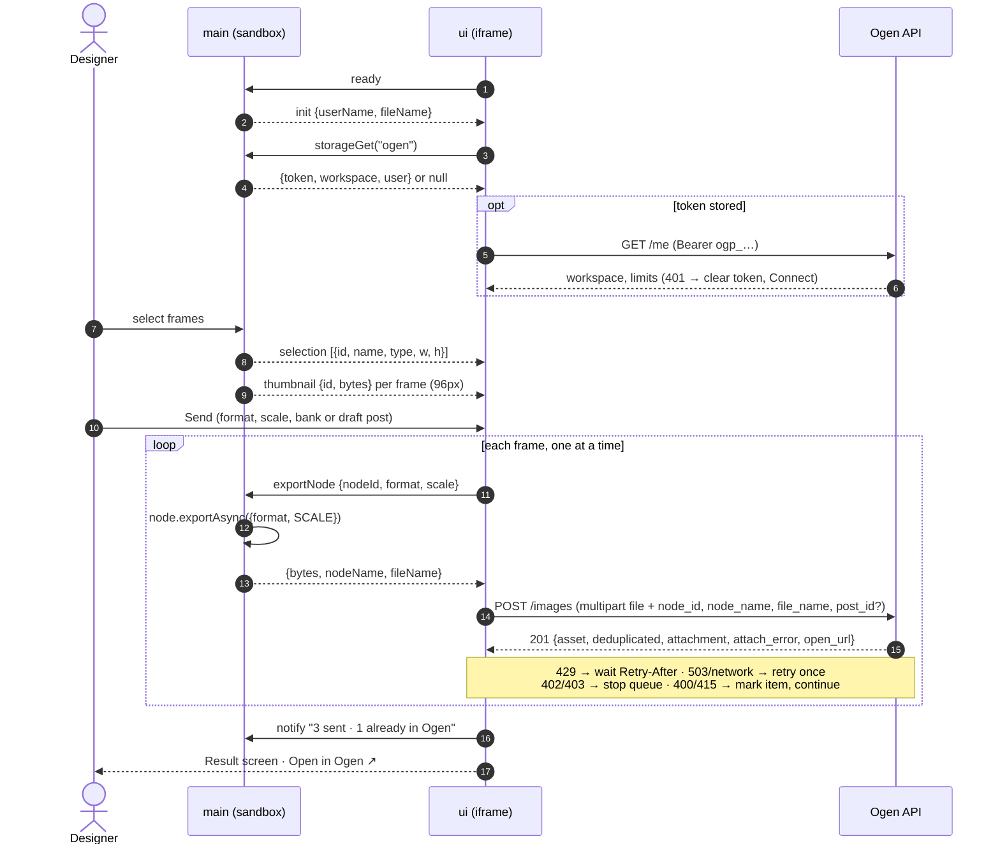
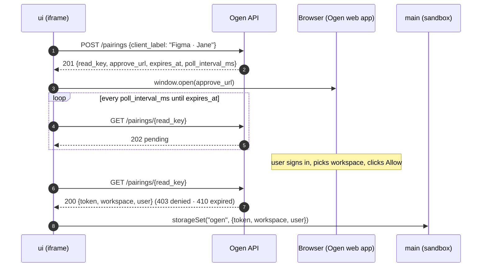

# Ogen Figma plugin

"Send to Ogen": select frames in Figma and send them to an Ogen workspace's
content bank, optionally attaching them to a draft post in the same step.

The plugin renders frames locally with `node.exportAsync()` and uploads the
bytes to Ogen's plugin API (`/api/plugins/figma/*`), authenticated by a plugin
token obtained once through a pairing flow. Ogen never calls Figma's REST API.
Backend and design: [CON-338](https://linear.app/ogen/issue/CON-338); this
plugin: [CON-340](https://linear.app/ogen/issue/CON-340).

## Requirements

- Node 22 (`.nvmrc`)
- Figma desktop app (plugins under development can only be imported there)
- For end-to-end runs: the Ogen API and UI running locally (`ogen-app/ogen`
  and `ogen-app/ui`), with the plugin API from CON-338

## Local development

```sh
npm ci
npm run dev        # dev build in watch mode, API at http://localhost:9001
```

1. Start the Ogen API locally on `:9001` (the port `ogen-app/ui` proxies to).
2. In Figma desktop: **Plugins → Development → Import plugin from manifest…**
   and pick this repo's `manifest.json`.
3. Run it from **Plugins → Development → Ogen**. Rebuilds are picked up the
   next time the plugin runs.
4. Logs and errors: **Plugins → Development → Show/Hide console**. Dev builds
   print an `[ogen] editorType=… file=… user=…` line on start (see
   [docs/spikes.md](docs/spikes.md)).

`npm run dev` only rebuilds `dist/` on changes. It does not start a web
server, so there is no page to open in a browser: the plugin runs inside
Figma.

Pairing opens the approval page at the API's `APP_BASE_URL`, which defaults
to production (`https://app.getogen.com`). To approve against your local
stack, set it in `ogen/.env` and run the Ogen UI (the approval page is
`/integrations/figma/connect`, CON-339):

```sh
# ogen/.env
APP_BASE_URL=http://localhost:9002
```

To use a different API (for example staging), set `OGEN_API_URL`:

```sh
OGEN_API_URL=https://staging-api.example.com npm run build:dev
```

The origin must be listed in `manifest.json` → `networkAccess`. Figma blocks
every other origin, and the build fails early if it is missing.

## Builds

| Command | API origin | Notes |
| -- | -- | -- |
| `npm run build:dev` | `http://localhost:9001` | unminified, prints the spike readout |
| `npm run build:prod` | `https://api.getogen.com` | minified; what gets published |

There is one `manifest.json` for both builds. `allowedDomains` holds the
production API, and `devAllowedDomains` holds localhost, which Figma only
honours for plugins under development. The API origin is compiled into the
bundle (`__API_BASE__`), so the two builds differ only in `dist/`.

`dist/code.js` is the main-thread bundle. `dist/ui.html` is the UI with its
JS and CSS inlined, because Figma loads the UI as a single HTML string.

## Checks

```sh
npm run check      # typecheck (UI, main, tests) + unit tests
```

CI runs the same checks and a production build on every PR.

## How it works

The plugin runs in two halves. `main` (`src/main`) runs in Figma's sandbox:
it has the `figma.*` API but no network. `ui` (`src/ui`) is an iframe with
origin `null`: it makes every request to Ogen but has no `figma.*`. They talk
through `postMessage` (`src/shared/messages.ts`).



Pairing (Connect screen) runs in the UI alone:



- **Pairing** (`src/api/pairing.ts`): `POST /pairings`, then the approve URL
  opens in the browser, then the plugin polls `GET /pairings/{read_key}`
  every `poll_interval_ms` until 200 (store the token), 403 (denied), 410 or
  `expires_at` (expired), or Cancel.
- **Storage**: `figma.clientStorage` key `ogen` holds
  `{token, workspace, user}`, and `ogen.prefs` holds `{format, scale}`. Main
  refuses any other key.
- **Sending** (`src/queue/sendQueue.ts`): the UI asks main to export one node,
  uploads it, and only then asks for the next. That keeps a single full-size
  export in memory.
- **Pre-flight** (`src/queue/preflight.ts`): frames over image-service's
  pixel cap at the chosen scale are flagged and skipped. Exports over
  `limits.max_image_bytes` (from `GET /me`) fail before upload.

### Error handling

| Response | Behaviour |
| -- | -- |
| 401 `plugin_token_invalid` | Clear storage and return to Connect: "Disconnected from Ogen." |
| 429 | Wait for `Retry-After`, then retry the same item |
| 402 / 403 (plan limit) | Stop the queue and show the limit message with an upgrade hint |
| 400 / 415 rejects | Mark the item failed and continue |
| 503 / network | Retry once, then mark the item failed |
| `attach_error` in a 201 | Item is in the bank; it shows why it wasn't attached |

## Layout

```
src/main/      Figma main thread: selection, thumbnails, export, storage
src/ui/        Preact UI: screens (Connect, Send, Sending, Result), components
src/api/       Ogen plugin API client, pairing, posts, image upload
src/queue/     send queue, pre-flight checks, error messages, summary
src/shared/    main ⇄ UI message protocol
scripts/       build (esbuild, inlines the UI into dist/ui.html)
docs/          day-one spikes
test/          vitest unit tests
```

## Release

Publishing to the Figma Community is tracked in
[CON-341](https://linear.app/ogen/issue/CON-341).

1. In Figma desktop, **Plugins → Development → New plugin…** once, to get the
   plugin id. Put it in `manifest.json` → `id`, replacing the
   `ogen-send-to-ogen` placeholder.
2. Bump `version` in `package.json` and merge to `main`.
3. Run `npm ci && npm run build:prod` from a clean checkout of `main`. Never
   publish a dev build: it points at localhost.
4. Re-import `manifest.json` if needed, then go to **Plugins → Development →
   Ogen → Publish…**. Figma uploads `manifest.json` and the `dist/` files as
   they are on disk.
5. Tag the release: `git tag v<version> && git push --tags`.

## Open items

- The manifest `id` is a placeholder until the plugin is created in Figma
  (release step 1).
- The production API origin is assumed to be `https://api.getogen.com`. Update
  `manifest.json` and `scripts/build.mjs` if it differs.
- `GET /me` doesn't return a pixel cap yet, so the plugin assumes
  image-service's default of 100 MP. If the API adds
  `limits.max_image_pixels`, the plugin already reads it.
- [docs/spikes.md](docs/spikes.md) still needs to be run in Figma desktop
  (Dev Mode export, file name visibility, sections and groups).
